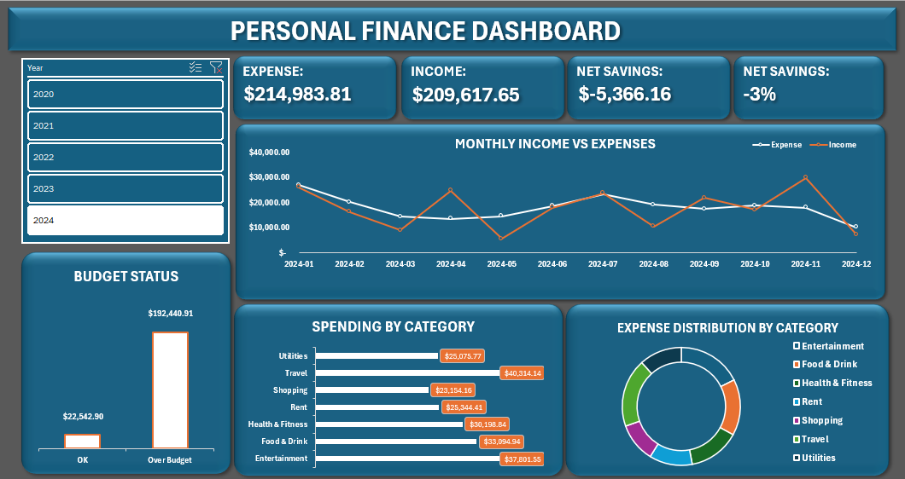

# 📊 Personal Finance Dashboard — Excel

A fully interactive personal finance dashboard built in Microsoft Excel using a public dataset from Kaggle. This project demonstrates end-to-end data analysis skills including data cleaning, modeling, formula writing, and dashboard design.

---

## 🛠️ Tools & Skills Used

| Tool / Feature | Purpose |
|---|---|
| Power Query | Data loading, cleaning, and transformation |
| XLOOKUP | Mapping categories to budget targets |
| SUMIF / IF | KPI calculations |
| Pivot Tables | Aggregating data for charts and KPIs |
| PivotCharts | Line, bar, and donut visualizations |
| Slicers | Interactive year filtering |
| Dashboard Design | KPI cards, layout, color theming |

---

## 📁 Dataset

- **Source:** [Personal Finance Data — Kaggle](https://www.kaggle.com/datasets/ramyapintchy/personal-finance-data)
- **Rows:** 1,500 transactions
- **Period:** 2020 – 2024
- **Columns:** Date, Transaction Description, Category, Amount, Type

**Categories:** Entertainment, Food & Drink, Health & Fitness, Investment, Other, Rent, Salary, Shopping, Travel, Utilities

---

## 🗂️ Workbook Structure

| Sheet | Description |
|---|---|
| `Personal_Finance_Dataset` | Original raw data — untouched |
| `Cleaned_Data` | Power Query output + calculated columns |
| `Budget_Ref` | Manual monthly budget targets per category |
| `Pivot_Table` | All pivot tables feeding the dashboard |
| `Dashboard` | Final interactive dashboard |

---

## 🔧 Data Cleaning (Power Query)

- Changed Date column from DateTime to Date format
- Filtered null values from Date and Category columns
- Added `Month-Year` column for time-series analysis
- Added `Year` column for slicer filtering
- Fixed `Type` column — Salary rows were incorrectly labeled as Expense, corrected to Income

---

## 📐 Calculated Columns (Cleaned Data Sheet)

| Column | Formula | Purpose |
|---|---|---|
| Monthly Budget | `XLOOKUP` | Pulls budget target per expense category |
| Over Budget Flag | `IF` | Flags transactions exceeding monthly budget |
| Net Amount | `IF` | Positive for income, negative for expenses |

---

## 📊 Dashboard Features

### KPI Cards
| KPI | Value (All Years) |
|---|---|
| Total Expense | $1,078,140.82 |
| Total Income | $883,140.55 |
| Net Savings | -$195,000.27 |
| Savings Rate | -22% |

### Charts
- **Monthly Income vs Expenses** — Line chart showing monthly trends across 2020–2024
- **Spending by Category** — Horizontal bar chart with dollar values per category
- **Expense Distribution by Category** — Donut chart showing % share per category
- **Budget Status** — Bar chart comparing total spend for OK vs Over Budget transactions

### Interactivity
- **Year slicer** — filters all KPIs and charts simultaneously by year
- Cross-filtering across all pivot tables via Report Connections

---

## 💡 Key Insights

- Expenses consistently exceeded income across all 5 years (-22% savings rate overall)
- **Over Budget transactions** account for the majority of total spending (~$192,440 vs $22,542 OK)
- **Travel** was the highest spending category (~$169,497 across all years)
- **Entertainment** was the top spending category in 2024 at ~$37,801
- Monthly expenses averaged approximately **$17,900**
- Spending is relatively evenly distributed across categories (13–16% each)
